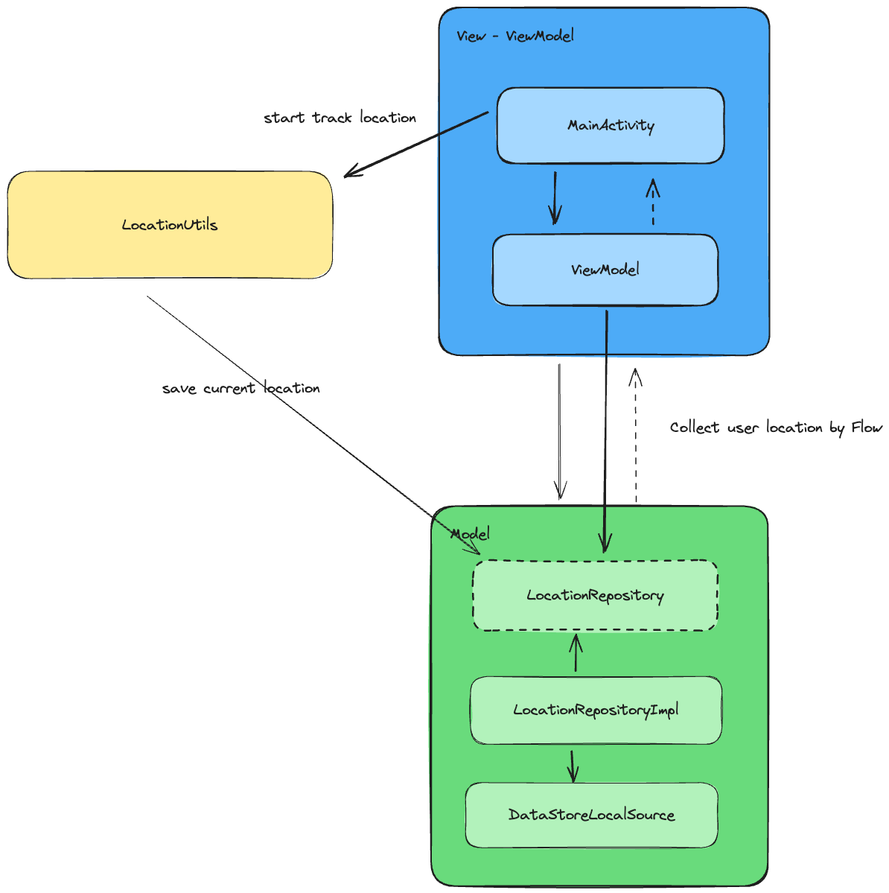

# RealTimeLocationPoc
This is an App to study about Location and Maps

### Video

### Features
This app gets the location of the user in real-time and shows the current address.

### Architecture
- MVVM

### Libs
- Maps
- Location Manager
- Geocoder
- DataStore
- Koin
- KotlinFlow

### Next steps
  -  Implement foreground service to allow app works in background

To use this app you need put your maps API KEY in local.properties
MAPS_API_KEY = your key here
